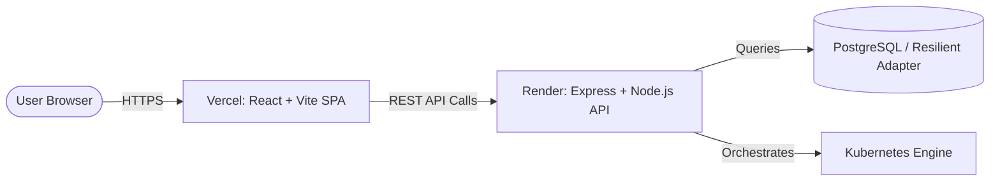

# 🚀 CloudDeploy — Vercel & Render Deployment Guide

This guide walks you through deploying the full **CloudDeploy** platform in under 5 minutes:
- **Backend API**: Deployed as a Web Service on **Render**
- **Frontend Dashboard**: Deployed as a Single Page Application (SPA) on **Vercel**

---

## 🏗️ Architecture

---

## 1️⃣ Deploy Backend on Render

### Step 1: Create a Web Service
1. Log in to your [Render Dashboard](https://dashboard.render.com/).
2. Click **New +** and select **Web Service**.
3. Connect your GitHub repository: `https://github.com/Nikhil9131/CloudDeploy-Containerized-CI-CD-Deployment-Platform.git`.

### Step 2: Configure Service Settings
Fill in the following details:

| Setting | Value |
| :--- | :--- |
| **Name** | `clouddeploy-backend` |
| **Region** | Oregon (US West) or Singapore / Frankfurt |
| **Branch** | `main` |
| **Root Directory** | `backend` |
| **Runtime** | `Node` |
| **Build Command** | `npm install && npm run build` |
| **Start Command** | `npm start` |
| **Instance Type** | Free |

### Step 3: Set Environment Variables
In the **Environment Variables** section on Render, add:

| Key | Value | Description |
| :--- | :--- | :--- |
| `NODE_ENV` | `production` | Enables production optimizations |
| `JWT_SECRET` | `clouddeploy_super_secret_jwt_key_2026_production_safe_min_32_chars` | Used to sign & verify JWT tokens |
| `JWT_EXPIRES_IN` | `7d` | Token expiry duration |
| `CORS_ORIGIN` | `*` | Allows calls from Vercel deployments |
| `DATABASE_URL` | *(Optional)* | PostgreSQL connection string. If omitted, the platform uses its built-in resilient database adapter with seed data! |

### Step 4: Deploy & Verify
1. Click **Create Web Service**.
2. Wait 2–3 minutes for the build and deployment to complete.
3. Test your backend live endpoints:
   - **Health Check**: `https://<your-render-backend>.onrender.com/health` → `{"status":"ok", ...}`
   - **API Catalog**: `https://<your-render-backend>.onrender.com/api` → `{"name":"CloudDeploy API", ...}`

> 📋 **Note your backend URL**: Copy your Render URL (e.g., `https://clouddeploy-backend.onrender.com`). You will need it in Step 2.

---

## 2️⃣ Deploy Frontend on Vercel

### Step 1: Import Project
1. Log in to [Vercel](https://vercel.com/dashboard).
2. Click **Add New…** → **Project**.
3. Select your repository: `CloudDeploy-Containerized-CI-CD-Deployment-Platform`.

### Step 2: Configure Project Settings
1. Click **Edit** next to **Root Directory** and select `frontend`.
2. Framework Preset will auto-detect as **Vite**.
3. Keep the default Build Command (`npm run build`) and Output Directory (`dist`).

### Step 3: Add Environment Variable
Under **Environment Variables**, add:

| Key | Value |
| :--- | :--- |
| `VITE_API_URL` | `https://<your-render-backend>.onrender.com` |

*(Replace with your actual Render backend URL from Step 1).*

### Step 4: Deploy!
1. Click **Deploy**.
2. Vercel will build and deploy your React dashboard in ~45 seconds.
3. Click your live Vercel URL (e.g., `https://clouddeploy-frontend.vercel.app`).

---

## 3️⃣ Default Demo Credentials

Once deployed, you can log in immediately with either of the pre-seeded accounts:

| Role | Email | Password |
| :--- | :--- | :--- |
| **Admin** | `admin@clouddeploy.io` | `AdminPass123!` |
| **Developer** | `developer@clouddeploy.io` | `DevPass123!` |

*You can also click **Register** to create any new custom user account!*

---

## 4️⃣ What's Included & Configured
- ✅ **SPA Routing on Vercel**: Handled automatically by `frontend/vercel.json` rewrites (no 404 on page reload).
- ✅ **CORS Compatibility**: Backend allows all Vercel origin domains (`*.vercel.app`) and configured origins.
- ✅ **Dynamic API Suffix Handling**: `frontend/src/services/api.js` automatically handles whether you provide the Render URL with or without `/api`.
- ✅ **Dual-Mode Resilient Database**: Works out of the box with PostgreSQL or with the self-contained in-memory fallback.
