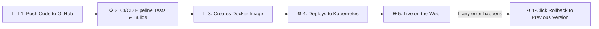

# 🚀 CloudDeploy – Containerized CI/CD Deployment Platform

A clean, modern platform to manage, build, and deploy containerized applications using **Docker**, **Kubernetes**, and **AWS**.

[](https://cloud-deploy-containerized-ci-cd-de.vercel.app)
[](https://clouddeploy-containerized-ci-cd.onrender.com)
[](https://www.docker.com/)
[](https://kubernetes.io/)

---

## 🌟 Try the Live Demo

You can test the live application right now without installing anything:

* **🖥️ Web Dashboard (Frontend)**: [cloud-deploy-containerized-ci-cd-de.vercel.app](https://cloud-deploy-containerized-ci-cd-de.vercel.app)
* **⚙️ API Server (Backend)**: [clouddeploy-containerized-ci-cd.onrender.com](https://clouddeploy-containerized-ci-cd.onrender.com)

### 🔑 Demo Login Accounts:
| Role | Email | Password |
| :--- | :--- | :--- |
| **Admin** | `admin@clouddeploy.io` | `AdminPass123!` |
| **Developer** | `developer@clouddeploy.io` | `DevPass123!` |

*(You can also click **Register** on the website to create your own account).*

---

## 💡 What is CloudDeploy? (In Simple Words)

When developers write code, they need an automated way to test it, pack it into a container, and run it on cloud servers without downtime. 

**CloudDeploy** is a web dashboard that makes this entire process visual and easy:

1. **Register Applications**: Add your GitHub repository and Docker settings.
2. **Trigger Deployments**: Click "Deploy" and watch an 11-step pipeline build and test your code live.
3. **See Real-Time Logs**: View terminal build logs as they happen in your browser.
4. **Monitor Health**: Check CPU usage, memory, uptime, and running pod instances.
5. **1-Click Rollback**: If a bug appears in a new version, click "Rollback" to instantly switch back to the last working version.

---

## 🛠️ Tech Stack Made Simple

| Tool | What It Does | Why We Use It |
| :--- | :--- | :--- |
| **React + Vite** | Frontend Dashboard | Fast, interactive user interface with dark mode and charts. |
| **Tailwind CSS** | Styling | Clean, modern design that looks great on mobile and desktop. |
| **Node.js & Express** | Backend API | Fast REST API that handles authentication, deployments, and logic. |
| **PostgreSQL & Prisma** | Database | Stores user accounts, applications list, and deployment history. |
| **Docker** | Containerization | Packages the application with everything it needs so it runs anywhere. |
| **Kubernetes** | Container Management | Automatically runs multiple copies of containers and restarts them if they fail. |
| **Terraform (AWS)** | Cloud Setup | Sets up AWS servers (EC2), secure networking (VPC), and storage (S3) automatically with code. |
| **GitHub Actions** | Automation | Runs tests and builds Docker images whenever you push new code. |
| **Vercel & Render** | Cloud Hosting | Free, instant hosting for the frontend (Vercel) and backend (Render). |

---

## 🔄 How It Works (Simple Workflow)



### The 11 Pipeline Steps (Visualized in Dashboard):
1. **Checkout**: Download the latest code from GitHub.
2. **Install**: Install libraries and dependencies.
3. **Lint**: Check code style and formatting.
4. **Unit Tests**: Run automated tests to make sure features work.
5. **Build App**: Compile the application into production files.
6. **Build Docker Image**: Package the app into a Docker container.
7. **Security Scan**: Check the container for known vulnerabilities.
8. **Push Image**: Send the Docker image to a container registry.
9. **Deploy to Kubernetes**: Update Kubernetes pods with the new image.
10. **Health Check**: Ping `/health` to verify the application responds.
11. **Complete**: Mark deployment as Live!

---

## 💻 How to Run Locally

### Option 1: The Quickest Way (Docker Compose)
If you have Docker installed on your computer:

```bash
docker compose up --build
```
* **Frontend**: Open `http://localhost:3000`
* **Backend API**: Open `http://localhost:5000`

---

### Option 2: Running Without Docker (Standard Node.js)

**Step 1: Start Backend**
```bash
cd backend
npm install
npm start
```
*(Backend runs on `http://localhost:5000`)*

**Step 2: Start Frontend (in a new terminal)**
```bash
cd frontend
npm install
npm run dev
```
*(Frontend runs on `http://localhost:5173`)*

Open `http://localhost:5173` in your browser and sign in!

---

## 📁 Project Structure

```text
├── frontend/               # React + Vite web dashboard
│   ├── src/pages/          # Dashboard, Deployments, Applications, Logs
│   ├── src/components/     # Pipeline visualizer, terminal log viewer, charts
│   └── vercel.json         # Vercel deployment configuration
├── backend/                # Express.js REST API
│   ├── src/controllers/    # API endpoints (Auth, Apps, Deployments)
│   ├── src/services/       # 11-stage pipeline orchestrator & rollback engine
│   ├── prisma/             # Database schema
│   └── tests/              # 14 automated unit & integration tests
├── k8s/                    # Kubernetes manifests (Deployments, Services, HPA)
├── terraform/              # AWS Cloud Infrastructure as Code (VPC, EC2, S3)
├── docker-compose.yml      # Local multi-container setup
├── DEPLOYMENT_GUIDE.md     # Step-by-step guide for Vercel & Render
└── README.md
```

---

## ❓ Frequently Asked Questions (FAQ)

#### 1. What happens if a deployment fails?
If tests fail, security scan finds issues, or the app fails to start, the pipeline immediately stops. The older version continues running so users experience **zero downtime**. You can also click **"Rollback"** at any time.

#### 2. What is Zero-Downtime deployment?
When updating an application, Kubernetes starts the new version first. Only when the new version responds with `200 OK` on `/health` does it shut down the old version.

#### 3. How does Auto-Scaling work?
If website traffic increases and CPU usage exceeds 70%, Kubernetes automatically starts extra copies (pods) of the application to handle the load. When traffic drops, it scales back down.

---

## 📄 License
This project is open-source under the MIT License.
